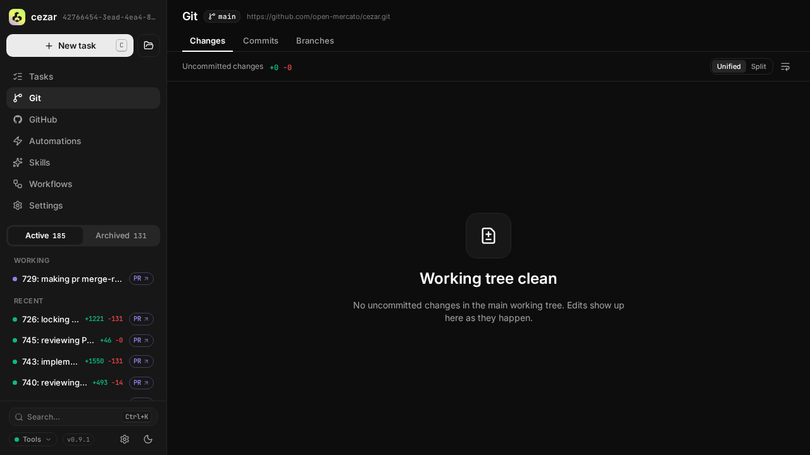
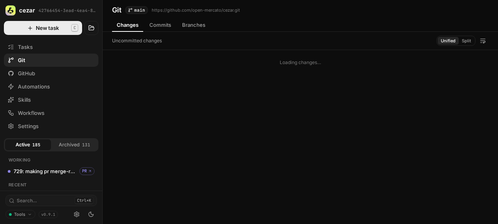
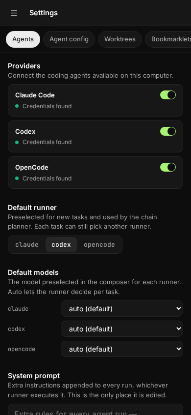
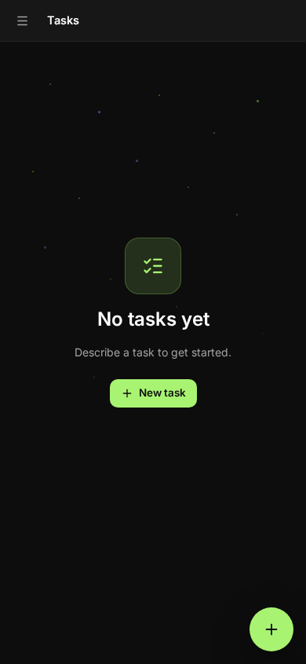

## 📸 UI QA evidence — PASS

**Verdict:** ✅ PASS — every required last-location startup and degradation checkpoint passed on the merged head.
**Environment:** `http://127.0.0.1:36709` · role `local unauthenticated cockpit` · browser `agent-browser 0.32.1`
**Verified:** `spec/restore-last-location` @ `7aec1fbc`

### Scenario (P1 — restore last project location)
**Where to click:** `/`, `/p/cezar/git`, `/p/cezar/settings/agents`, and `/settings/global`

| # | Step | Expected | Observed | Result |
|---|------|----------|----------|--------|
| 1 | Open `/p/cezar/git?qa=fresh-7aec#changed` and wait for persistence. | Store the exact project, pathname, query, and fragment. | Workspace UI state returned the same four location fields. | ✅ |
| 2 | Open the exact bare `/`, then use browser Back. | Replace root with the saved route and keep transient root out of history. | The URL restored exactly; Back remained on the restored URL. | ✅ |
| 3 | Open explicit project Settings, visit global Settings, then restore at 390 × 844. | The explicit route remains authoritative, global Settings does not overwrite it, and mobile stays usable. | The exact project Settings URL restored and the Agents pane rendered without page or console errors. | ✅ |
| 4 | Seed a structurally valid route for a removed project, then open `/`. | Ignore stale state and fall back to the boot project. | The responsive boot-project Tasks empty state rendered without page or console errors. | ✅ |

### Screenshots

### Notes for QA
- The production build ran under `CEZ_DRY_RUN=1` with an isolated `CEZ_HOME`, so no real agent credentials or developer workspace state were exercised.
- The host `/tmp` quota was exhausted. The browser provider succeeded after its disposable Chrome profile was placed in `/dev/shm`; this was an environment workaround, not a product change.
- This was an evidence-only run. It did not add `qa-approved`.
- The change still has no committed browser-level test; the existing follow-up scenario on the PR remains applicable.
