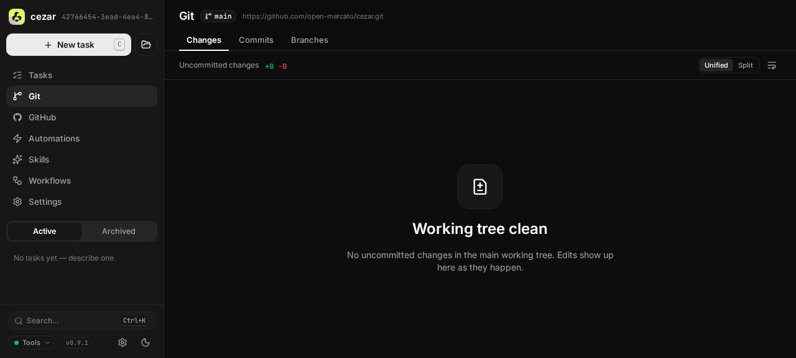
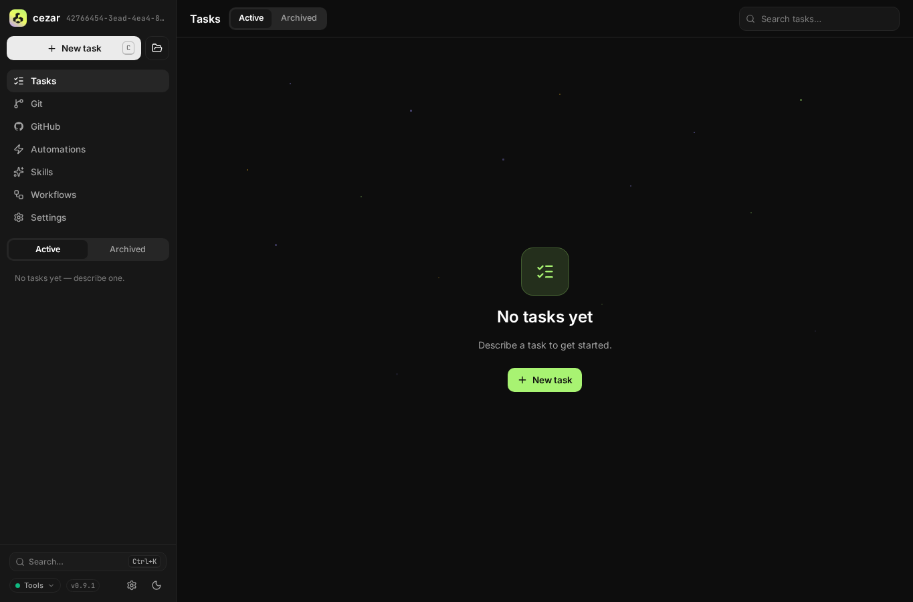

## 📸 UI QA evidence — PASS

**Verdict:** ✅ PASS — every required startup-routing and persistence scenario behaved as specified.
**Environment:** `http://127.0.0.1:60893` · role `local unauthenticated cockpit` · browser `agent-browser 0.32.1`
**Verified:** `spec/restore-last-location` @ `2b875231`

### Scenario (P1 — last project location)

**Where to click:** `/p/cezar/git?qa=restore#changed`, `/`, `/p/cezar/settings/agents?manual=1#config`, and `/settings/global/appearance`

| # | Step | Expected | Observed | Result |
|---|------|----------|----------|--------|
| 1 | Open a registered project route and wait for persistence. | Store the exact project, pathname, query, and fragment. | Workspace UI state returned `/p/cezar/git?qa=restore#changed` with all four fields. | ✅ |
| 2 | Open the exact bare root and use browser Back after restoration. | Replace `/` with the saved route and keep the transient root out of history. | The URL became `/p/cezar/git?qa=restore#changed`; Back remained on the restored URL. | ✅ |
| 3 | Open an explicit project Settings URL, visit global Settings, and restore at 390 × 844. | Keep the explicit URL authoritative, avoid overwriting it from global Settings, and render cleanly on mobile. | State retained `/p/cezar/settings/agents?manual=1#config`; bare root restored it exactly with no page or console errors. | ✅ |
| 4 | Save a route for a project absent from the registry and open `/`. | Ignore stale state and fall back to the boot project. | The URL became the boot-project root and the Tasks empty state rendered without browser errors. | ✅ |

### Screenshots

### Notes for QA

- The test environment was started from the production build with `CEZ_DRY_RUN=1` and an isolated `CEZ_HOME` under `.ai/qa`; it used no real credentials.
- Browser page-error and console collections were empty at the primary restored and fallback checkpoints.
- The change ships no committed browser-level test. The follow-up scenario should persist a registered-project route, reopen `/`, assert exact restoration and history replacement, then seed an absent project and assert boot-project fallback.
